# 🏗️ Kiến Trúc Hệ Thống RAG Chatbot - Quản Lý Bảo Trì Thiết Bị Y Tế

> Tài liệu mô tả chi tiết kiến trúc và các luồng xử lý (flow) của hệ thống RAG Chatbot,
> dựa trên mã nguồn thực tế tại repository `RAGchatbot/`.

---

## 📑 Mục Lục

1. [Tổng Quan Hệ Thống](#1-tổng-quan-hệ-thống)
2. [Công Nghệ Sử Dụng](#2-công-nghệ-sử-dụng)
3. [Cấu Trúc Thư Mục](#3-cấu-trúc-thư-mục)
4. [Sơ Đồ Kiến Trúc Tổng Quan](#4-sơ-đồ-kiến-trúc-tổng-quan)
5. [Luồng Khởi Động Ứng Dụng](#5-luồng-khởi-động-ứng-dụng)
6. [Luồng Xác Thực (Authentication)](#6-luồng-xác-thực-authentication)
7. [Luồng Tạo Phiên Chat](#7-luồng-tạo-phiên-chat)
8. [Luồng Xử Lý Tin Nhắn (Core Flow)](#8-luồng-xử-lý-tin-nhắn-core-flow)
9. [Luồng Phân Loại Ý Định (Intent Classification)](#9-luồng-phân-loại-ý-định-intent-classification)
10. [Luồng RAG - Hỏi Đáp Quy Trình (Q_AND_A)](#10-luồng-rag---hỏi-đáp-quy-trình-q_and_a)
11. [Luồng Tra Cứu Sửa Chữa (REPAIR_STATUS)](#11-luồng-tra-cứu-sửa-chữa-repair_status)
12. [Luồng Báo Hỏng Thiết Bị (CREATE_REPAIR_REQUEST)](#12-luồng-báo-hỏng-thiết-bị-create_repair_request)
13. [Luồng Chat Tự Do (GENERAL)](#13-luồng-chat-tự-do-general)
14. [Luồng Nạp Dữ Liệu (Data Ingestion)](#14-luồng-nạp-dữ-liệu-data-ingestion)
15. [Mô Hình Dữ Liệu](#15-mô-hình-dữ-liệu)
16. [Phân Quyền RBAC](#16-phân-quyền-rbac)
17. [Biến Môi Trường](#17-biến-môi-trường)
18. [Ranh Giới Module](#18-ranh-giới-module)

---

## 1. Tổng Quan Hệ Thống

Hệ thống là một **RAG Chatbot thông minh** phục vụ quản lý bảo trì thiết bị y tế trong bệnh viện, được xây dựng trên FastAPI với kiến trúc **Intent-based Routing** (định tuyến dựa trên ý định).

### Bốn chức năng nghiệp vụ chính:

| # | Ý Định (Intent) | Mô Tả |
|---|---|---|
| 1 | **Q_AND_A** | Hỏi đáp quy trình kỹ thuật, hướng dẫn sử dụng thiết bị dựa trên tài liệu (RAG thực thụ) |
| 2 | **REPAIR_STATUS** | Tra cứu trạng thái sửa chữa thiết bị từ cơ sở dữ liệu MySQL (có phân quyền RBAC) |
| 3 | **CREATE_REPAIR_REQUEST** | Tạo phiếu báo hỏng thiết bị trực tiếp qua chat |
| 4 | **GENERAL** | Chào hỏi, trò chuyện tự do, giới thiệu chức năng chatbot |

---

## 2. Công Nghệ Sử Dụng

| Thành Phần | Công Nghệ |
|---|---|
| Web Framework | **FastAPI** |
| ASGI Server | **Uvicorn** |
| LLM Provider | **Google Gemini** (`gemini-2.5-flash`) via `langchain-google-genai` |
| Intent Classifier | **Gemini** (JSON mode, `temperature=0.0`) |
| Embedding Model | **HuggingFace** `sentence-transformers/all-MiniLM-L6-v2` |
| Vector Store | **ChromaDB** (persistent, top-k=5) |
| Relational DB | **MySQL** via SQLAlchemy Async + `aiomysql` |
| Authentication | **JWT Bearer** (HS256, scope `rag:chat`) |
| Streaming | **Server-Sent Events (SSE)** |
| Schema Validation | **Pydantic** |

---

## 3. Cấu Trúc Thư Mục

```
RAGchatbot/
├── app/
│   ├── __main__.py               # Entry point FastAPI, lifespan, include router
│   ├── init_db.py                # Khởi tạo bảng database khi startup
│   ├── api/
│   │   └── chat_routes.py        # POST /sessions và POST /stream
│   ├── auth/
│   │   └── auth.py               # JWT Bearer xác thực, RagPrincipal
│   ├── core/
│   │   ├── config.py             # Load GOOGLE_API_KEY từ .env
│   │   ├── database.py           # Async SQLAlchemy engine/session
│   │   ├── prompt.py             # Prompt template RAG cho Q_AND_A
│   │   └── security.py
│   ├── models/
│   │   ├── chat_session.py       # Model: rag_chat_sessions
│   │   └── chat_message.py       # Model: rag_chat_messages
│   ├── repositories/
│   │   ├── session_repository.py # CRUD phiên chat
│   │   └── message_repository.py # CRUD tin nhắn
│   ├── schemas/
│   │   ├── chat.py               # ChatStreamRequest
│   │   └── session.py            # CreateSessionResponse
│   └── services/
│       ├── chat_service.py       # Điều phối: lưu tin nhắn + stream SSE
│       ├── rag_service.py        # Dispatcher trung tâm: phân loại → xử lý → LLM
│       ├── router_service.py     # Phân loại ý định (Intent Classifier) bằng Gemini
│       ├── db_query_service.py   # Truy vấn MySQL: thiết bị, phiếu sửa chữa, RBAC
│       ├── llm_service.py        # Khởi tạo Gemini LLM client
│       ├── retriever_service.py  # ChromaDB retriever (top-k=5)
│       └── embedding_service.py  # HuggingFace embedding + Chroma vector store
├── data/
│   ├── failure-QA-data/          # CSV dữ liệu hỏi đáp lỗi thiết bị
│   └── system-guide-data/        # CSV dữ liệu hướng dẫn hệ thống
├── scripts/
│   └── ingest_csv.py             # Script nạp dữ liệu CSV → ChromaDB
├── vector_db/                    # ChromaDB persistent storage
├── requirements.txt
└── .env
```

---

## 4. Sơ Đồ Kiến Trúc Tổng Quan

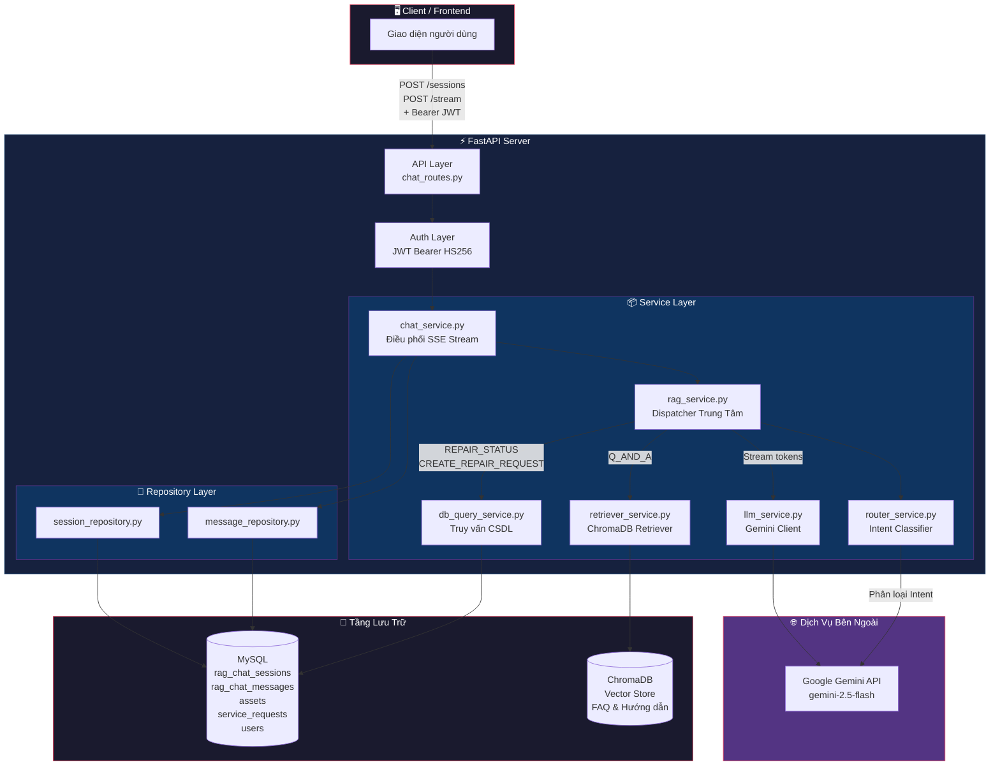

---

## 5. Luồng Khởi Động Ứng Dụng

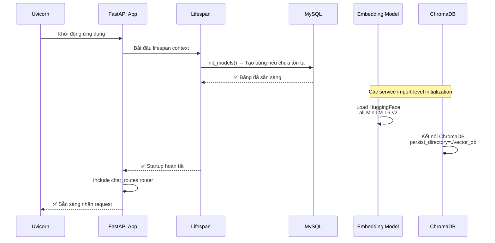

**Lệnh khởi chạy:**
```bash
uvicorn app.__main__:app --reload
```

---

## 6. Luồng Xác Thực (Authentication)

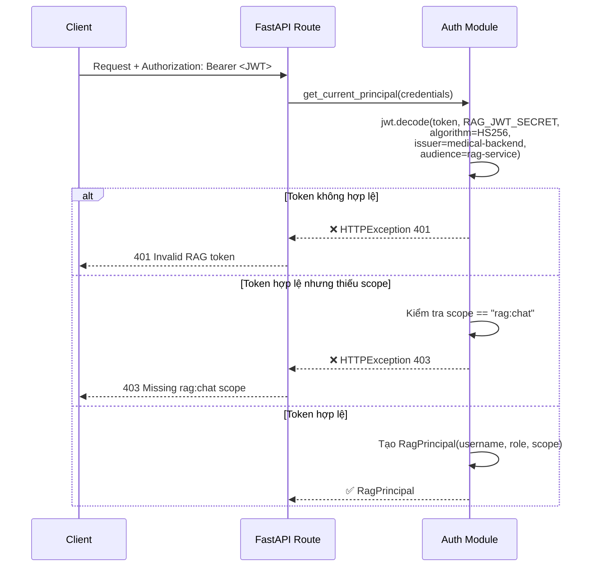

**Cấu trúc JWT Token yêu cầu:**

| Trường | Giá Trị | Mô Tả |
|--------|---------|-------|
| `sub` | username | Tên đăng nhập người dùng |
| `role` | ADMIN / MANAGER / DOCTOR / ENGINEER | Vai trò trong hệ thống |
| `scope` | `rag:chat` | Quyền truy cập chatbot (bắt buộc) |
| `iss` | `medical-backend` | Nhà phát hành token |
| `aud` | `rag-service` | Đối tượng token hướng đến |

---

## 7. Luồng Tạo Phiên Chat

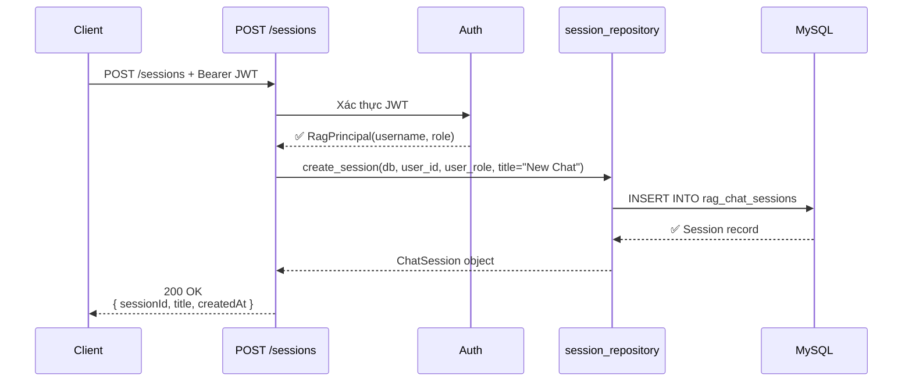

---

## 8. Luồng Xử Lý Tin Nhắn (Core Flow)

Đây là luồng chính khi người dùng gửi tin nhắn qua `POST /stream`. Hệ thống sử dụng mô hình **Intent-based Routing** để định tuyến xử lý.

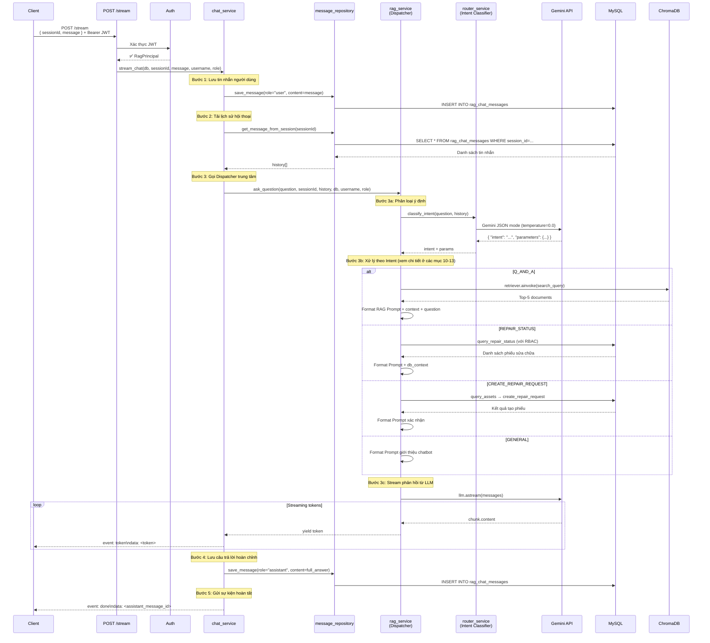

---

## 9. Luồng Phân Loại Ý Định (Intent Classification)

Hệ thống sử dụng **Gemini LLM ở chế độ JSON** (`response_mime_type="application/json"`, `temperature=0.0`) để phân loại ý định với độ chính xác cao.

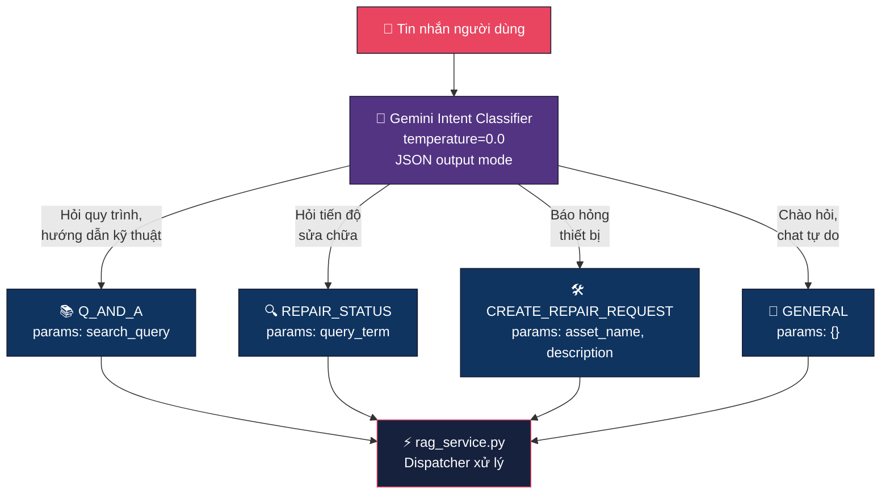

### System Prompt cho Intent Classifier

Classifier nhận một `SystemMessage` mô tả chi tiết 4 nhóm intent và định dạng output JSON bắt buộc:

```json
{
  "intent": "Q_AND_A" | "REPAIR_STATUS" | "CREATE_REPAIR_REQUEST" | "GENERAL",
  "parameters": { ... }
}
```

### Ví dụ phân loại:

| Tin nhắn | Intent | Parameters |
|----------|--------|------------|
| "Cách sửa lỗi E01 máy thở?" | `Q_AND_A` | `{"search_query": "lỗi E01 máy thở"}` |
| "Phiếu sửa chữa số 12 thế nào?" | `REPAIR_STATUS` | `{"query_term": "12"}` |
| "Báo hỏng máy ECG bị chập nguồn" | `CREATE_REPAIR_REQUEST` | `{"asset_name": "máy ECG", "description": "chập nguồn"}` |
| "Chào bạn" | `GENERAL` | `{}` |

---

## 10. Luồng RAG - Hỏi Đáp Quy Trình (Q_AND_A)

Đây là luồng **RAG thực thụ** — truy xuất tài liệu từ ChromaDB rồi đưa vào prompt cho LLM.

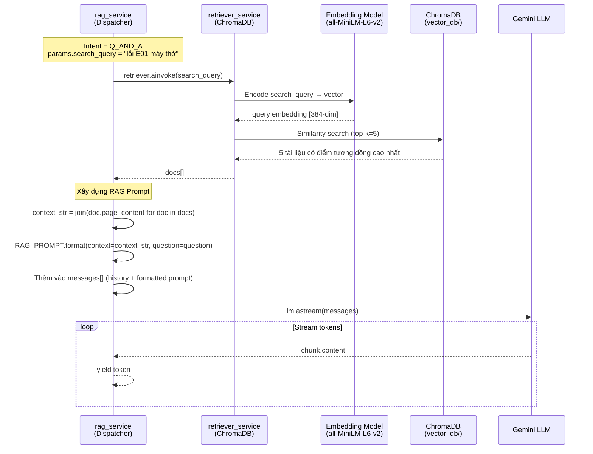

### RAG Prompt Template (`app/core/prompt.py`):

```
Bạn là chatbot AI cho hệ thống quản lí, bảo trì thiết bị y tế.
Nhiệm vụ: trả lời dựa hoàn toàn vào ngữ cảnh được cung cấp.

QUY TẮC:
1) Chính xác tuyệt đối - chỉ dùng thông tin trong NGỮ CẢNH
2) Thành thật - nếu không có đủ thông tin, nói rõ
3) Ngắn gọn, rõ ràng - dùng bullet points
4) Giọng điệu chuyên nghiệp, lịch sự

Ngữ cảnh: {context}
Câu hỏi: {question}
```

---

## 11. Luồng Tra Cứu Sửa Chữa (REPAIR_STATUS)

Luồng này truy vấn **trực tiếp MySQL** với bộ lọc bảo mật **RBAC** dựa trên vai trò người dùng.

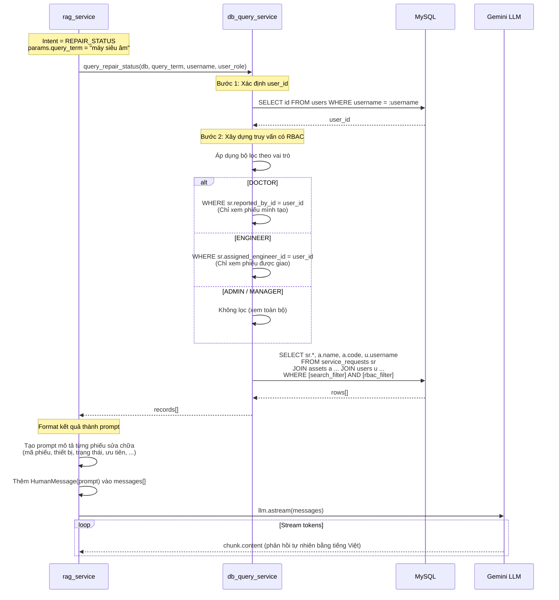

---

## 12. Luồng Báo Hỏng Thiết Bị (CREATE_REPAIR_REQUEST)

Luồng phức tạp nhất — bao gồm nhiều bước xác nhận trước khi tạo phiếu trong database.

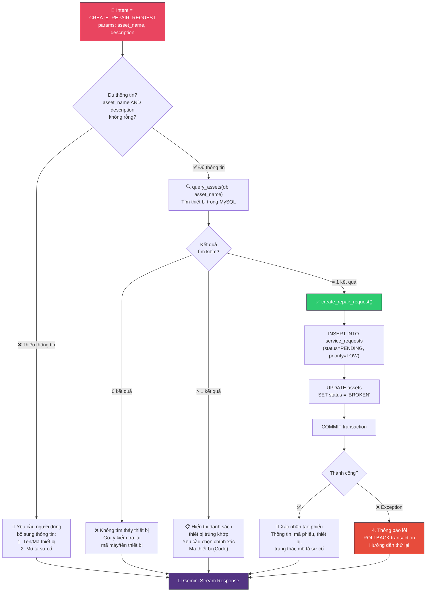

---

## 13. Luồng Chat Tự Do (GENERAL)

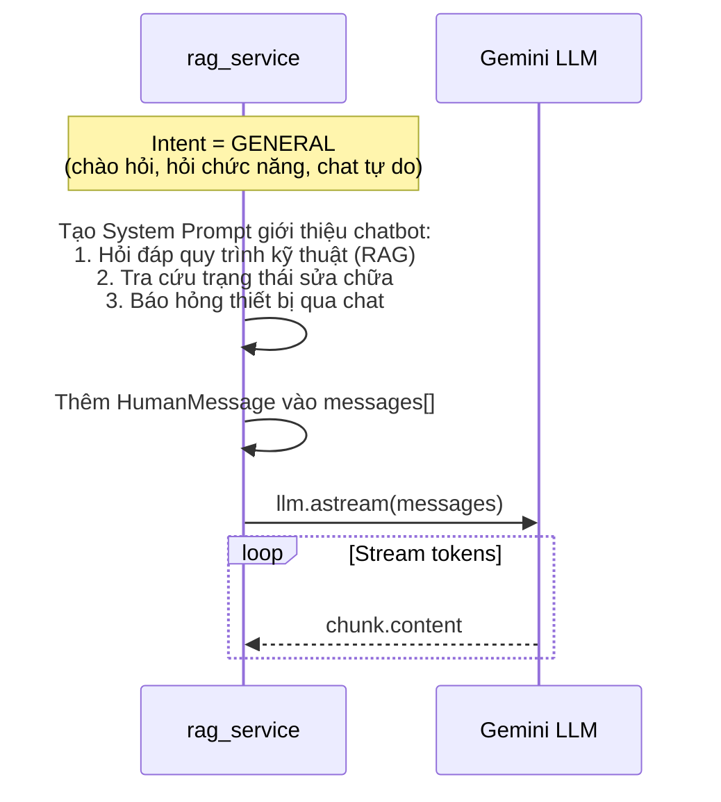

---

## 14. Luồng Nạp Dữ Liệu (Data Ingestion)

Luồng **offline** — chạy một lần để nạp dữ liệu CSV vào ChromaDB trước khi sử dụng RAG.

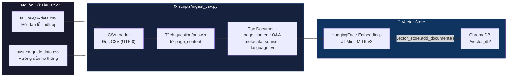

**Lệnh chạy nạp dữ liệu:**
```bash
cd RAGchatbot
python -m scripts.ingest_csv
```

### Cấu trúc Document sau khi format:
```
question: Cách khắc phục lỗi E01 máy thở?
answer: Kiểm tra nguồn điện, reset hệ thống, ...
```

---

## 15. Mô Hình Dữ Liệu

### Sơ đồ ERD (Bảng liên quan đến RAG Chatbot)

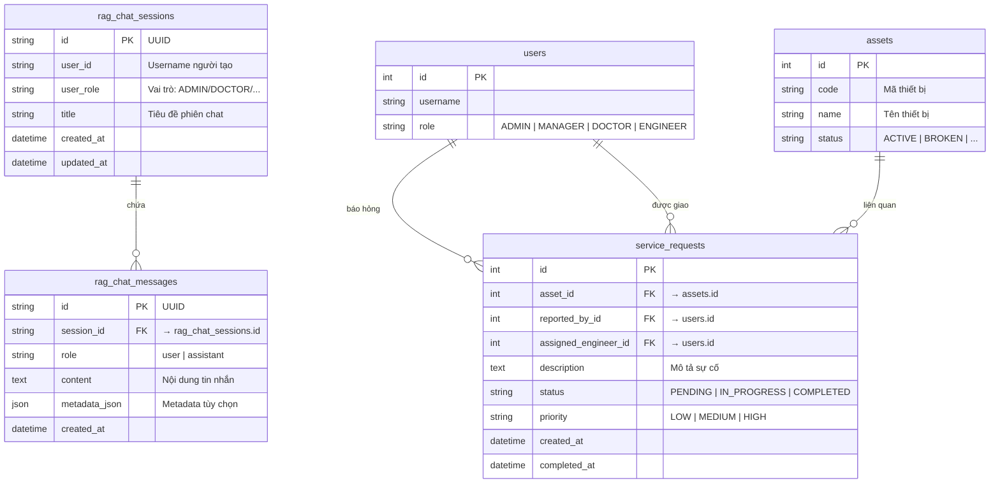

---

## 16. Phân Quyền RBAC

Hệ thống áp dụng **Role-Based Access Control** ở 2 tầng:

### Tầng 1: JWT Authentication (API Gateway)
- Mọi request phải có JWT token với `scope: rag:chat`
- Token chứa `username` và `role` của người dùng

### Tầng 2: Database Query Filtering (Data Layer)

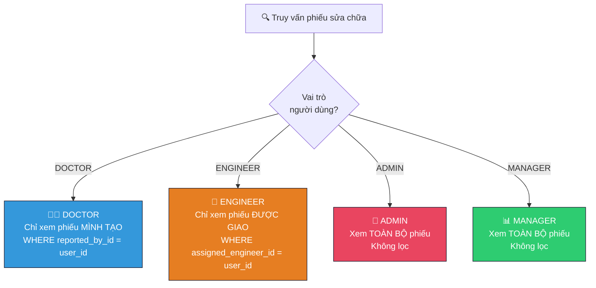

---

## 17. Biến Môi Trường

| Biến | Bắt Buộc | Giá Trị Mặc Định | Mô Tả |
|------|----------|-------------------|--------|
| `GOOGLE_API_KEY` | ✅ | — | API key Google Gemini |
| `RAG_JWT_SECRET` | ✅ | — | Secret key mã hóa JWT |
| `RAG_JWT_ISSUER` | ❌ | `medical-backend` | Nhà phát hành JWT |
| `RAG_JWT_AUDIENCE` | ❌ | `rag-service` | Đối tượng JWT |
| `DATABASE_URL` | ✅ | Hard-coded | Connection string MySQL |

---

## 18. Ranh Giới Module

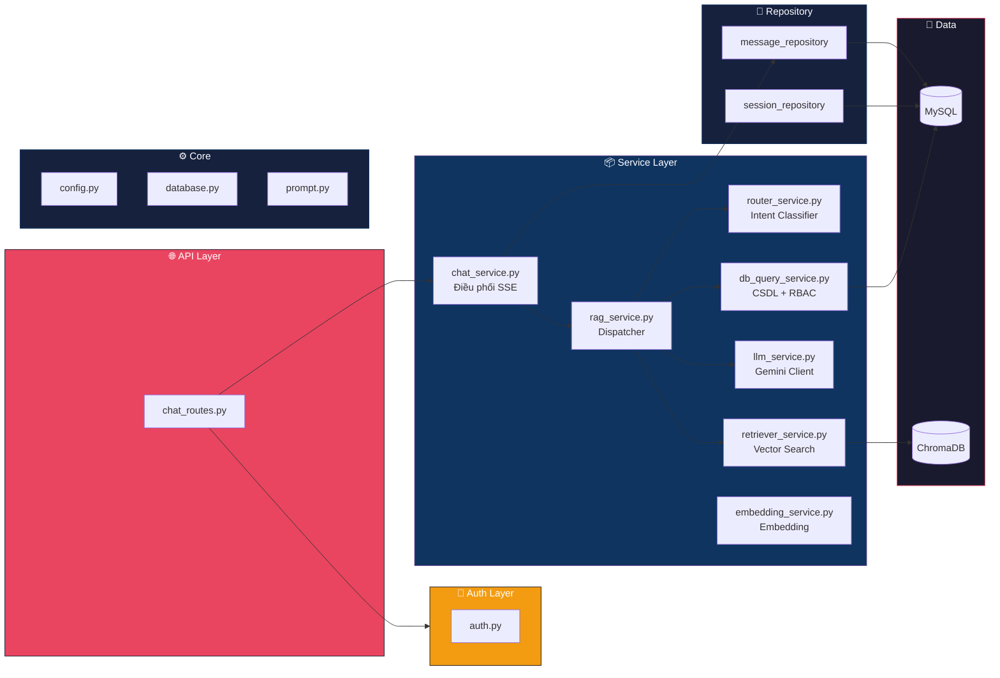

| Module | Trách Nhiệm |
|--------|-------------|
| `app/api` | HTTP endpoints, dependency injection, response type |
| `app/auth` | Xác thực JWT và tạo RagPrincipal |
| `app/core` | Config, database engine, prompt template dùng chung |
| `app/models` | SQLAlchemy table mapping (ORM) |
| `app/repositories` | CRUD/query database |
| `app/schemas` | Pydantic request/response models |
| `app/services` | Business logic: dispatching, intent classification, RAG, LLM streaming, DB query |
| `scripts` | Xử lý dữ liệu offline (ingestion) |
| `data` | Nguồn dữ liệu CSV gốc |
| `vector_db` | ChromaDB persisted vectors |

---

> 📝 **Ghi chú**: Tài liệu này phản ánh chính xác mã nguồn hiện tại tại thời điểm viết. Code đã tích hợp đầy đủ RAG retrieval trong nhánh `Q_AND_A`, truy vấn database có RBAC cho `REPAIR_STATUS` và `CREATE_REPAIR_REQUEST`.
